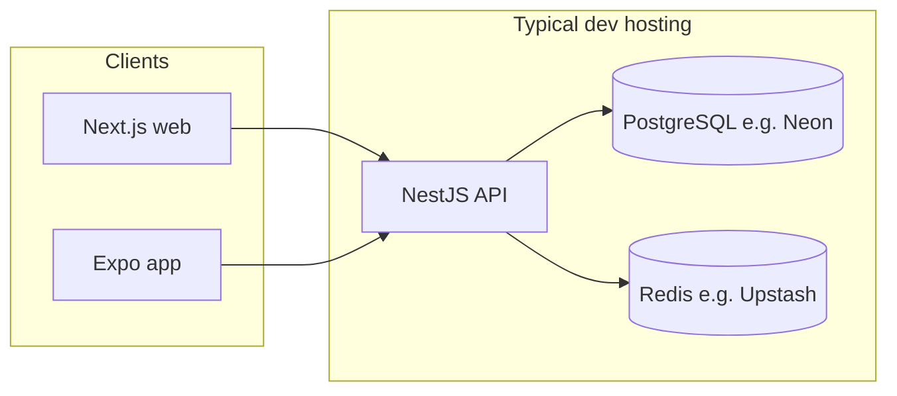

# Development deployment runbook (SafeTag / TheWileyfox)

This document describes how to run and **deploy a development or staging environment** for end-to-end testing: **NestJS API**, **Next.js web**, **Expo mobile**, plus **PostgreSQL** and **Redis**.

**Repository layout:** `safetag/` monorepo — `apps/backend`, `apps/web`, `apps/mobile`, `packages/shared`.

---

## 1. Architecture overview

For development-period hosting, split **compute** (API) from **data** (Postgres, Redis). The API must be a **long-running Node process** (WebSockets, BullMQ workers); serverless-only API hosting is not suitable for the full backend feature set.



**Default local ports (reference):**

| Service    | Port / note |
|-----------|-------------|
| Next.js   | `3001` (`pnpm --filter @safetag/web dev`) |
| Nest API  | `3002` recommended (see `apps/backend/.env.example`; code default is `3000` if `PORT` unset) |
| Postgres  | `5433` host → container `5432` (`docker-compose.yml`) |
| Redis     | `6380` host → container `6379` |

---

## 2. Local full stack (baseline before cloud)

From the monorepo root (`safetag/`):

1. **Start Postgres + Redis**

   ```bash
   docker compose up -d
   ```

2. **Environment files**  
   Copy and fill `safetag/.env` and `apps/backend/.env` per `apps/backend/.env.example`. Canonical values are documented there (database host `localhost`, Postgres **5433**, Redis **6380**).

3. **Install and migrate**

   ```bash
   pnpm install
   pnpm --filter @safetag/backend db:migrate
   ```

4. **Run apps (separate terminals)**

   ```bash
   pnpm --filter @safetag/backend dev
   pnpm --filter @safetag/web dev
   pnpm --filter @safetag/mobile dev
   ```

5. **Web and mobile API base URL (local)**  
   - Web uses `NEXT_PUBLIC_API_URL` (defaults to `http://localhost:3002/api/v1` in code).  
   - Mobile uses `EXPO_PUBLIC_API_URL` (same default pattern).  
   Set `PORT=3002` on the backend and keep URLs consistent.

---

## 3. Environment variables cheat sheet (hosted dev)

Configure these on the **backend** host (secrets) and in **Vercel** / **EAS** for clients (public URLs only where noted).

### 3.1 Backend (NestJS)

| Variable | Purpose |
|----------|---------|
| `NODE_ENV` | `production` or `development` |
| `PORT` | Often `3000` or `8080` on PaaS (platform may inject `PORT`; respect it if required) |
| `DATABASE_URL` | PostgreSQL connection string (hosted DB) |
| `REDIS_HOST` / `REDIS_PORT` | Or your Redis URL per `ioredis` config (Upstash often uses TLS; use the provider’s docs) |
| `JWT_SECRET` | Strong random value |
| `CORS_ORIGINS` | Comma-separated origins: your **Vercel web URL**, optional `exp://` origins for dev, no trailing slashes unless you already use them consistently |
| `PUBLIC_BASE_URL` | Public **web** origin (e.g. `https://your-app.vercel.app`) |
| `API_BASE_URL` | Public **API** prefix if used for links (e.g. `https://api.your-domain.com/api/v1`) |
| `GOOGLE_CALLBACK_URL` | Must match **hosted** OAuth redirect (e.g. `https://api…/api/v1/auth/google/callback`) |
| `MOBILE_APP_SCHEME` | Must match `apps/mobile/app.json` → `expo.scheme` (`thewileyfox`) |
| Optional | `CLOUDINARY_*`, `MAPBOX_ACCESS_TOKEN`, email/SMS/push providers — use `console` modes for minimal dev |

See `apps/backend/.env.example` for the full list.

### 3.2 Web (Next.js)

| Variable | Purpose |
|----------|---------|
| `NEXT_PUBLIC_API_URL` | Full API base, e.g. `https://your-api.example.com/api/v1` |

Referenced in `apps/web/src/lib/api.ts` and related components.

### 3.3 Mobile (Expo)

| Variable | Purpose |
|----------|---------|
| `EXPO_PUBLIC_API_URL` | Same as web: `https://your-api.example.com/api/v1` |
| `EXPO_PUBLIC_WEB_URL` | Your deployed **web** origin (used for deep links / web flows; see `apps/mobile/app/(app)/tags.tsx`) |

Set these in **EAS build secrets / env** or an `apps/mobile/.env` used at build time (Expo bakes `EXPO_PUBLIC_*` at build).

**Android cleartext:** Production API must use **HTTPS**. `http://` to a LAN IP is only for local debugging.

---

## 4. Database and Redis (free-tier friendly)

| Role | Suggested services (verify current quotas) |
|------|---------------------------------------------|
| PostgreSQL | [Neon](https://neon.tech), [Supabase](https://supabase.com) |
| Redis | [Upstash](https://upstash.com) |

After provisioning:

1. Put `DATABASE_URL` (and Redis settings) in backend environment.
2. Run migrations **against the hosted database** from your machine or CI:

   ```bash
   cd safetag
   # Point DATABASE_URL at hosted DB (e.g. export in shell or .env)
   pnpm --filter @safetag/backend db:migrate
   ```

3. Optionally seed admin or test data per project scripts (`db:seed-admin` in `apps/backend/package.json`).

---

## 5. Backend hosting options

Requirements: **always-on** container or VM, **HTTPS** in front (reverse proxy or platform TLS), health check on HTTP.

### Option A — Fly.io (good for Dockerized API)

1. Add a `Dockerfile` for `apps/backend` if not present (multi-stage: `pnpm install`, `pnpm --filter @safetag/backend build`, run `start:prod`).
2. `fly launch`, set secrets (`DATABASE_URL`, `JWT_SECRET`, etc.).
3. Attach custom domain if needed; ensure `CORS_ORIGINS` includes the web origin.

Check Fly’s **current** free allowance; it changes over time.

### Option B — Render (Web Service)

1. Connect GitHub, select Docker or Node build.
2. Set **start command** to `pnpm --filter @safetag/backend start:prod` (or `node dist/main` from built output).
3. **Free tier:** service may **sleep** after idle → cold starts; acceptable for demos, painful for daily QA.

### Option C — Small VPS (Hetzner, DigitalOcean, etc.)

1. Install Docker, run API container + optionally **self-host** Postgres/Redis (or still use Neon/Upstash).
2. Use Caddy or nginx for TLS.

**Not recommended for full backend:** deploying only the API to **Vercel serverless** as-is, if you depend on **Socket.IO** and **BullMQ** in the same process.

---

## 6. Frontend (Next.js) on Vercel

The web app is `@safetag/web` (Next.js 15, dev script uses port `3001`).

1. Import the **monorepo** Git repository into Vercel.
2. **Root directory:** `safetag` (or repo root if the app lives there).
3. **Framework preset:** Next.js.
4. **Install command:** `pnpm install` (Vercel should detect `pnpm` via `packageManager` in root `package.json`).
5. **Build command:** `pnpm --filter @safetag/web build`
6. **Output:** default Next.js (no static export required).
7. **Environment variables:** `NEXT_PUBLIC_API_URL=https://<your-api-host>/api/v1`

If the workspace root is confusing to Vercel, set the project **Root Directory** in the UI to `apps/web` only if you duplicate install steps; the recommended pattern is **monorepo root + filtered build** above.

Redeploy after changing `NEXT_PUBLIC_*`.

---

## 7. Mobile: Android APK / AAB for testers (EAS)

The app is **Expo SDK 52** (`apps/mobile`). **EAS Build** is the standard path.

### 7.1 One-time setup

1. Install EAS CLI: `pnpm add -g eas-cli` (or `npm i -g eas-cli`).
2. `cd safetag/apps/mobile`
3. `eas login`
4. `eas build:configure` (if you have not already; the repo includes `eas.json` with `development`, `preview`, `production` profiles).

### 7.2 Build profiles (see `apps/mobile/eas.json`)

| Profile | Use |
|---------|-----|
| `development` | Dev client + internal distribution |
| `preview` | **Internal testing APK** (`android.buildType`: `apk`) |
| `production` | **Play Store**-oriented **AAB** |

### 7.3 Commands

**Preview APK (sideload to testers):**

```bash
cd safetag/apps/mobile
eas build --platform android --profile preview
```

**Production AAB (Play Console internal testing):**

```bash
eas build --platform android --profile production
```

Set **EAS secrets** or environment for the build:

- `EXPO_PUBLIC_API_URL`
- `EXPO_PUBLIC_WEB_URL`

### 7.4 Local Android build (alternative)

For advanced use:

```bash
cd safetag/apps/mobile
pnpm exec expo prebuild --platform android
pnpm exec expo run:android --variant release
```

Release signing and keystore are your responsibility unless you use EAS credentials.

---

## 8. OAuth, deep links, and CORS checklist

Before asking testers to use **Google sign-in** or **mobile OAuth**:

1. **Google Cloud Console:** Authorized redirect URIs must include the **hosted** `GOOGLE_CALLBACK_URL`.
2. **Backend:** `GOOGLE_CALLBACK_URL`, `PUBLIC_BASE_URL`, `CORS_ORIGINS` match Vercel + API URLs.
3. **Mobile:** `MOBILE_APP_SCHEME` in backend matches `app.json` `scheme` (`thewileyfox`).
4. **Universal links** (`associatedDomains`, Android intent filters) point at production domains (`wileyfox.app` in `app.json`); staging may need alternate associated domains or builds that target staging hosts (plan separately).

---

## 9. Free and low-cost tier summary (development period)

| Layer | Service type | Notes |
|-------|--------------|--------|
| Web | **Vercel** Hobby | Strong default for Next.js; watch bandwidth/build limits. |
| API | **Fly.io** / **Render** free / small **VPS** | API must stay awake for sockets/queues; Render free sleeps. |
| Postgres | **Neon** / **Supabase** | Generous dev tiers; check connection limits. |
| Redis | **Upstash** | TLS and connection caps; configure Nest/ioredis accordingly. |
| Media | **Cloudinary** | Free tier for development uploads if enabled. |

**Reality check:** one single “all-in-one” free PaaS running Postgres, Redis, and a never-sleeping Node API is uncommon. The **split architecture** (Vercel + managed DB + managed Redis + small API host) is the practical dev/staging pattern.

---

## 10. Verification steps (smoke test)

1. `GET https://<api>/api/v1/...` (health or public route if available) returns 200.
2. Web loads from Vercel; login or signup hits the hosted API (browser Network tab).
3. Mobile build with `EXPO_PUBLIC_API_URL` can log in and load a main screen.
4. If using queues/notifications: confirm Redis connectivity (no silent failures in logs).

---

## 11. Troubleshooting

| Symptom | Things to check |
|---------|------------------|
| Web “cannot reach API” | `NEXT_PUBLIC_API_URL`, CORS, API HTTPS, API actually running |
| Mobile works on Wi‑Fi dev but not installed APK | APK was built without `EXPO_PUBLIC_API_URL` pointing to **public** HTTPS API |
| 401 / OAuth loop | `GOOGLE_CALLBACK_URL`, client IDs, redirect URI in Google console |
| DB errors after deploy | Migrations not run on hosted `DATABASE_URL` |
| Redis / BullMQ errors | Wrong host/port/TLS; Upstash URL format |

---

## 12. Related files

- `safetag/docker-compose.yml` — local Postgres/Redis
- `safetag/apps/backend/.env.example` — backend variables
- `safetag/apps/web/src/lib/api.ts` — `NEXT_PUBLIC_API_URL`
- `safetag/apps/mobile/src/services/api.ts` — `EXPO_PUBLIC_API_URL`
- `safetag/apps/mobile/app.json` — bundle IDs, scheme, intent filters
- `safetag/apps/mobile/eas.json` — EAS build profiles

---

*Last updated to match the monorepo layout and package names (`@safetag/backend`, `@safetag/web`, `@safetag/mobile`). Re-verify third-party free tiers before relying on them in production.*
